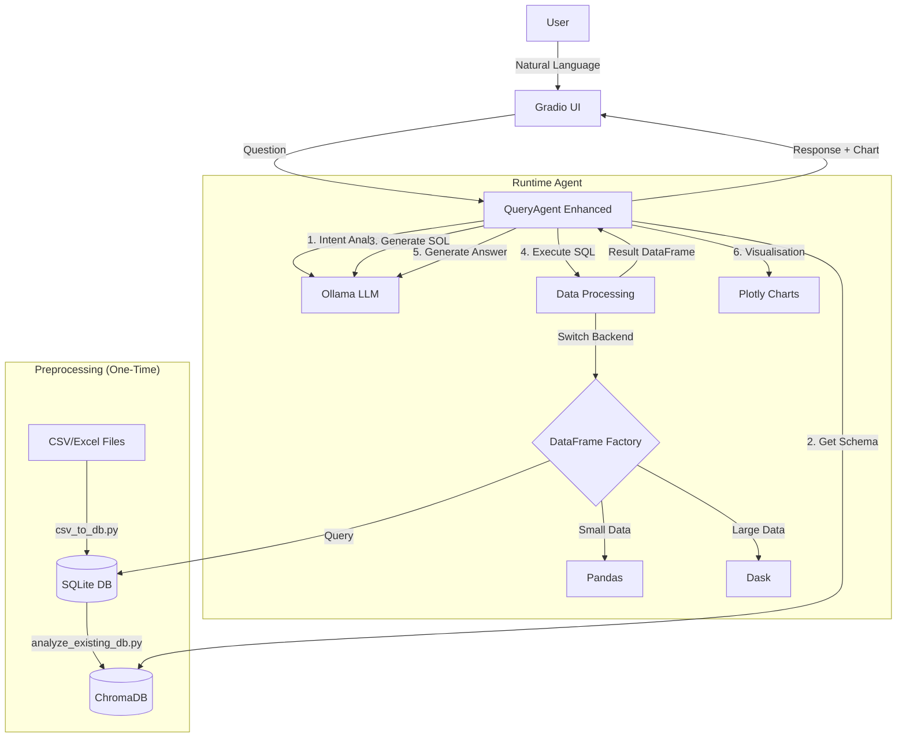
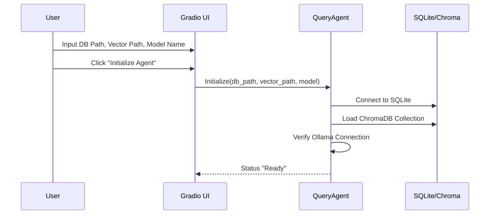
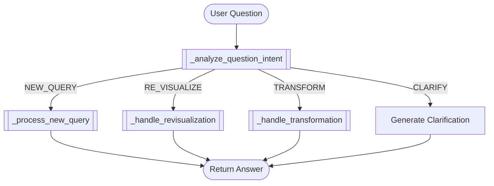
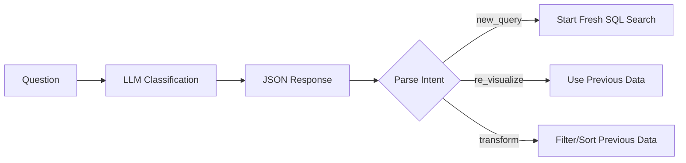
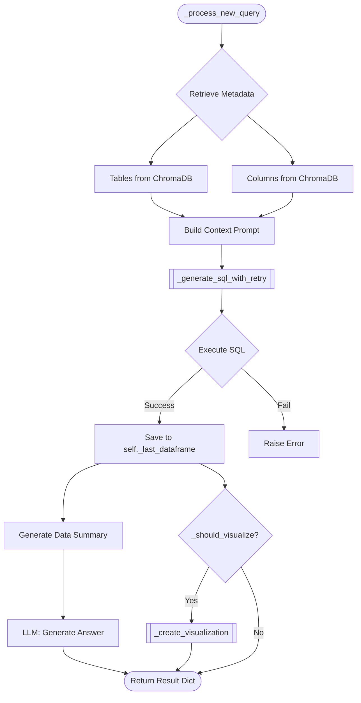
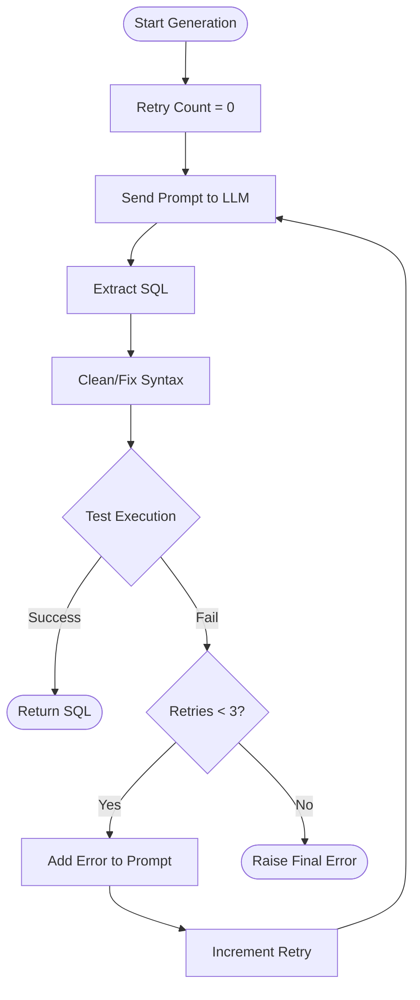

# Chat-with-DB System Documentation

## 1. System Overview

**Chat-with-DB** is a local RAG (Retrieval-Augmented Generation) system designed to interact with structured data stored in SQLite databases using natural language. It leverages local LLMs (via Ollama) to translate natural language questions into SQL queries, executes them, and visualizes the results.

### Key Features
- **Privacy-First**: Runs locally using Ollama and local databases.
- **Hybrid Data Processing**: Uses **Pandas** for small datasets and **Dask** for large datasets (millions of rows), switching automatically.
- **Multi-Turn Conversations**: Maintains context across questions (e.g., "Show me sales", then "Filter for 2024").
- **Semantic Search**: Uses ChromaDB to understand database schema and business context.
- **Visualization**: Automatically generates Plotly charts when appropriate.

---

## 2. Architecture

### High-Level Architecture


### Component Breakdown

| Component | File | Description |
|-----------|------|-------------|
| **UI Layer** | `app_gradio_enhanced.py` | The frontend interface built with Gradio. Handles user input, chat history, and rendering charts. |
| **Logic Layer** | `QueryAgent_Ollama_Enhanced.py` | The "Brain". Orchestrates the RAG pipeline: retrieves schema, prompts LLM, runs SQL, and formats answers. |
| **Data Factory** | `dataframe_factory.py` | An abstraction layer that returns either a `pd.DataFrame` or `dd.DataFrame` based on data volume. |
| **State Manager** | `conversation_manager.py` | Manages chat history, previous data contexts, and visualizations for multi-turn reasoning. |
| **Vector Store** | `chroma_db_768dim/` | Stores embeddings of table descriptions and column metadata to help the LLM understand the DB schema. |

---

## 3. Getting Started (Setup Workflow)

Before the chat application can run, data must be prepared. This is a two-step process.

### Step 1: Ingest Data
**Script:** `PRE/csv_to_db.py`
Input: CSV File -> Output: SQLite Database Table

1.  Reads CSV in chunks.
2.  Uses LLM to analyze column types and suggest a schema.
3.  Creates a table in the SQLite database.
4.  Inserts data.

### Step 2: Analyze Metadata (The "Indexing" Phase)
**Script:** `PRE/analyze_existing_db.py`
Input: SQLite Database -> Output: ChromaDB Vector Store

1.  Connects to the SQLite database.
2.  Iterates through all tables and columns.
3.  Uses LLM to generate "Business Descriptions" for every column (e.g., inferring "txn_dt" is "Transaction Date").
4.  Embeds these descriptions into ChromaDB for semantic retrieval.

---

## 4. Workflows & Flow Charts

### 4.1. System Initialization
When `app_gradio_enhanced.py` starts:



### 4.2. Main Question Pipeline (A to Z)
This is what happens when a user asks a question.

```mermaid
flowchart TD
    Start([User Question]) --> Intent{Analyze Intent}
    
    Intent -- "New Query" --> SemanticSearch[Search VectorDB for Tables/Columns]
    Intent -- "Re-visualize/Filter" --> LoadContext[Load Previous DataFrame]
    
    SemanticSearch --> PromptGen[Build Prompt with Schema]
    LoadContext --> PromptGen
    
    PromptGen --> SQLGen[Generate SQL via LLM]
    SQLGen --> CleanSQL[Clean & Fix SQL Syntax]
    
    CleanSQL --> Execute{Execution}
    Execute -->|Success| DataFrame[Unified DataFrame]
    Execute -->|Error| RetryLoop[Retry SQL Generation (Max 3)]
    RetryLoop -->|Fail| ReturnError([Return Error Message])
    
    DataFrame --> SizeCheck{Check Data Size}
    SizeCheck -->|Small| PandasViz[Analyze for Viz (Pandas)]
    SizeCheck -->|Large| DaskViz[Sample Data (Dask)]
    
    PandasViz --> AnswerGen[Generate Text Answer]
    PandasViz --> VizGen{Need Visualization?}
    
    VizGen -- Yes --> CreateChart[Create Plotly Chart]
    VizGen -- No --> TextOnly[Text Response Only]
    
    AnswerGen --> FinalResponse
    CreateChart --> FinalResponse
    FinalResponse --> UI([Display in Chat])
```

### 4.3. DataFrame Factory Logic
How the system decides between Pandas and Dask.

```mermaid
flowchart LR
    Input[SQL Result] --> Estimate[Estimate Row Count]
    Estimate --> Decision{Rows > 10M?}
    
    Decision -- Yes --> Dask[Use Dask (Partitions = 8)]
    Decision -- No --> CheckSmall{Rows > 100k?}
    
    CheckSmall -- Yes --> DaskOpt[Use Dask (Optimized)]
    CheckSmall -- No --> Pandas[Use Pandas]
    
    Dask --> UnifiedDF[Unified DataFrame Object]
    DaskOpt --> UnifiedDF
    Pandas --> UnifiedDF
```

---

## 5. Detailed Function Logic (Key Methods)

### `QueryAgentEnhanced.answer_question_with_context`
**File:** `QueryAgent_Ollama_Enhanced.py`
This is the main entry point for the agent.

1.  **Intent Analysis**: Calls `_analyze_question_intent` to see if the user wants a new query or to modify the previous one.
2.  **Dispatch**:
    *   If `RE_VISUALIZE` or `TRANSFORM`: Calls `_handle_revisualization` or `_handle_transformation` using cached data.
    *   If `NEW_QUERY`: Calls `_process_new_query`.



### `_analyze_question_intent`
Determines what the user wants to do.



### `_process_new_query(question, intent)`
1.  **Schema Retrieval**: Calls `search_tables` and `search_columns` to find relevant tables in ChromaDB based on the question's semantics.
2.  **Context Prompting**: construct a system prompt that includes:
    *   The user question.
    *   The relevant table schemas (DDL).
    *   Sample rows.
    *   Previous conversation context (if any).
3.  **SQL Generation**: Calls `_generate_sql_with_retry`.
4.  **SQL Execution**:
    *   Executes via `DataFrameFactory.from_sql`.
    *   Stores result in `self._last_dataframe`.
5.  **Answer Generation**: Passes the dataframe summary to the LLM to get a natural language answer.
6.  **Visualization**: Calls `_should_visualize` and `_create_visualization`.



### `_generate_sql_with_retry`
A robust loop for generating valid SQL:
1.  Generates SQL using LLM.
2.  Cleans formatting (removes markdown code blocks).
3.  **Dry Run**: Tries to `EXPLAIN` or execute the query.
4.  **Self-Correction**: If execution fails, it feeds the *error message* back to the LLM and asks for a correction.
5.  Repeats up to 3 times.



### `_create_visualization`
1.  Analyzes the data to determine the best chart type (Bar, Line, Scatter, Pie).
2.  Selects X and Y axes using heuristics or LLM advice.
3.  Uses `plotly.graph_objects` to generate a JSON representation of the chart.
4.  Returns the JSON to Gradio for rendering.

---

## 6. Directory Structure & Key Files

```
Chat-with-DB/
├── app_gradio_enhanced.py       # Main Application Entry Point
├── QueryAgent_Ollama_Enhanced.py # Core RAG Agent Class
├── conversation_manager.py      # Chat History Logic
├── dataframe_factory.py         # Pandas/Dask Abstraction
├── PRE/                         # Pre-processing Scripts
│   ├── csv_to_db.py             # Data Ingestion
│   └── analyze_existing_db.py   # Embedding Generation
└── conversations/               # Saved Chat Logs (JSON)
```

## 7. Configuration

Environmental variables (in `.env`):
- `OLLAMA_BASE_URL`: Url for Ollama (default `http://localhost:11434`)
- `MODEL_NAME`: Default model (e.g., `qwen2.5:7b`)

## 8. For New Developers: Where to Start?

1.  **Run the Setup**: Try running `PRE/csv_to_db.py` on a dummy CSV to understand how databases are built.
2.  **Read the Prompts**: Look at `QueryAgent_Ollama_Enhanced.py` around line 400 (`_build_context_prompt`). This is how the LLM is instructed.
3.  **Trace a Query**: Add logging in `process_question` in `app_gradio_enhanced.py` and follow the flow into `agent.answer_question_with_context`.
